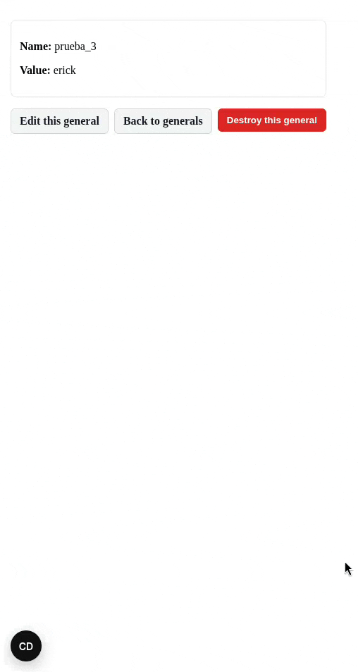
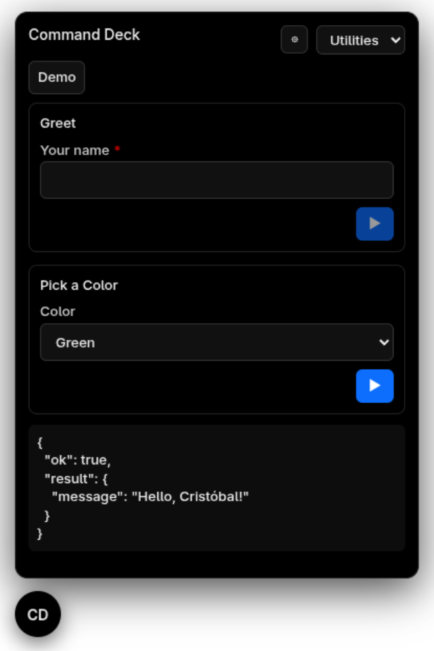

# Command Deck

Convenient, unobtrusive, dev-oriented Rails engine that allows you to run custom actions and quick admin tasks through a floating panel without opening the Rails console.

Define panels/tabs/actions with a minimal class-based DSL. Each action can declare parameters (text, boolean, number, selector), run Ruby code, and return a JSON result shown in the UI.



## Installation

Add the gem to your application:

```ruby
# Gemfile (development and test recommended for Sorbet/Tapioca)
group :development, :test do
  gem 'command_deck'
end
```

Mount the engine:

```ruby
# config/routes.rb
mount CommandDeck::Engine => '/command_deck' if defined?(CommandDeck::Engine)
```

Enable it in your development environment:

```bash
# .env.development.local (or your environment config)
COMMAND_DECK_ENABLED=true
```

**That's it!** The gem automatically:

- Discovers panel files in `app/command_deck/**/*.rb` and `packs/**/command_deck/**/*.rb`
- Adds them to autoload paths
- Inserts middleware when `COMMAND_DECK_ENABLED=true` in development
- Stays completely inactive in production

## Define actions

Create panel classes anywhere under a `command_deck` directory. Use descriptive namespaces:

```ruby
# app/command_deck/panels/utilities.rb
module CommandDeck::Panels
  class Utilities < CommandDeck::BasePanel
    panel 'Utilities' do
      tab 'Demo' do
        action 'Greet', key: 'utils.greet' do
          param :name, :string, label: 'Your name', required: true

          perform do |p, _ctx|
            { message: "Hello, #{p[:name]}!" }
          end
        end

        action 'Pick a Color', key: 'utils.color' do
          # You can pass simple arrays, pairs, or hashes as choices
          param :color, :selector,
            options: [
              ['Red',   'red'],
              ['Green', 'green'],
              ['Blue',  'blue']
            ],
            include_blank: true

          perform do |p, _ctx|
            { chosen: p[:color] }
          end
        end

        action 'Update Setting', key: 'utils.update_setting' do
          # Selector with current values in meta
          param :setting_name, :selector,
            collection: -> {
              # Example: fetch settings with current values
              [
                { label: 'Max Users (100)', value: 'max_users', meta: { value: 100 } },
                { label: 'Timeout (30)', value: 'timeout', meta: { value: 30 } }
              ]
            }

          # Auto-populate this input with the value from meta
          param :new_value, :string, required: true, auto_populate: true

          perform do |p, _ctx|
            # Update the setting with new value
            { ok: true, setting: p[:setting_name], new_value: p[:new_value] }
          end
        end
      end
    end
  end
end
```

### For modularized monoliths (packwerk/pack-rails)

You can organize panels within your packs:

```ruby
# packs/dev_tools/command_deck/panels/database.rb
module DevTools::Panels
  class Database < CommandDeck::BasePanel
    panel 'Database Tools' do
      tab 'Maintenance' do
        action 'Rebuild Cache', key: 'db.rebuild_cache' do
          perform do |_p, _ctx|
            Rails.cache.clear
            { ok: true, message: 'Cache cleared' }
          end
        end
      end
    end
  end
end
```

The gem auto-discovers panels in any `command_deck` directory under your app or packs. Use namespaces that match your project structure.



## DSL API

Panels inherit from `CommandDeck::BasePanel`. Define tabs within a panel:

```ruby
tab(title) { ... }
```

Define actions within a tab:

```ruby
action(title, key:) { ... }
```

Declare params and execution logic within an action:

```ruby
param(name, type, **opts)
perform { |params, ctx| ... }
```

Supported param types:

- `:string` – free text input.
- `:boolean` – checkbox; coerces to true/false.
- `:integer` – number input; coerces to Integer or nil when blank.
- `:selector` – dropdown. See options below.

Common param options:

- `label:` String – UI label. Defaults to a humanized `name`.
- `required:` true/false – disables Run button until filled. Default: false.
- `auto_populate:` true/false – for text/number inputs, automatically populate with value from previous selector's `meta: { value: ... }`. Default: false.

Selector-specific options:

- `options:` Enumerable – static choices.
- `collection:` -> Enumerable – dynamic choices (block is called each render).
- `include_blank:` true/false – prepend an empty choice. Default: false.
- `return:` `:value` (default), `:label`, or `:both` (`{ label:, value: }`).
- Choice shapes accepted:
  - Values: `%w[a b c]`
  - Pairs: `[['Label A', 'a'], ['Label B', 'b']]`
  - Objects: `{ label:, value:, meta?: { ... } }`

The `perform` block receives coerced params and a context hash. Return any JSON-serializable object (Hash recommended).

## Security

Intended for development only. **DO NOT ENABLE IN PRODUCTION**.

## Development

Run tests and lint:

```bash
bundle install
bundle exec rake test
bundle exec rubocop
```

## License

MIT License. See `LICENSE.txt`.

## Code of Conduct

Everyone interacting in this project is expected to follow the [Code of Conduct](https://github.com/crow-rojas/command_deck/blob/master/CODE_OF_CONDUCT.md).
